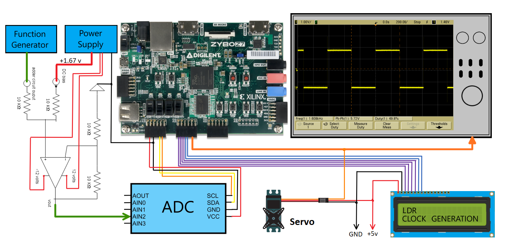
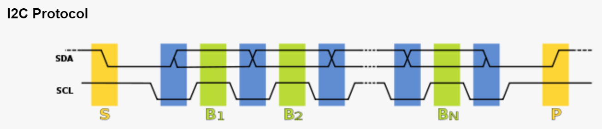
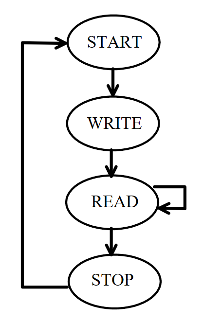
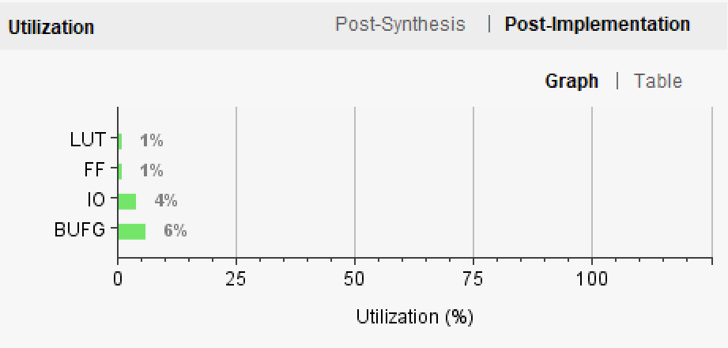

# Sampling Analog Sensors with I2C  
### Author: Justin Marcy
### Date: 4/12/2019

### Abstract
The purpose of this design is to generate, sample, store and reconstruct analog signals. The system samples four different signals; three of them are sensor values while the fourth is an externally generated signal. The system can switch between these input modes given user input. The sampled input values are referenced with block memory and are then used to create a pulse width modulation signal used to drive a servo motor. Our approach divided the system into three modules. The first section generated a specific analog signal that was modified through an operational amplifier circuit. The second part handled the serial I2C interface, which communicated data between the sampling equipment and the FPGA board. The last part was responsible for interpreting the data on the board and sending the appropriate signals to the output devices. The design was implemented successfully and met the required specifications. However, the optional digital-to-analog output was unable to produce a signal. Our average minimum frequency output error was 33.6% while our average maximum frequency error was 9.7%.

### Hardware & Components 
1) Digilent Zybo Z7-10 FPGA Board
2) PCF8591 ADC-DAC Module
3) Function Generator
4) Power Supply 
5) Breadboard & Wire
6) LM741 Operational Amplifier
7) 16x2 LCD Display (5v)
8) 9 Gram Servo
9) Oscilloscope

### Analog Sensor Inputs
* Light Dependent Resistor (LDR):
This sensor is built into the ADC. As light intensity increases, the output resistance decreases.
* Thermistor:
This sensor is built into the ADC. As temperature increases, the output resistance decreases.
* Op-Amp Adder Circuit:
This input is generated through a circuit using a power supply, function generator, and an LM741 operational amplifier. The function generator provides an analog waveform while the power supply provides a DC offset that is half the signals amplitude. These two signals are concatenated together to form a positive periodic waveform with a voltage range of 0v to 3.3v. 
* Potentiometer:
This sensor is built into the ADC. A manual nob is turned to change the resistance, thus changing output voltage

### Mode Specifications
* Standard Mode:
The default mode of the system allows any 1 out of the 4 analog inputs to be sampled. The user may toggle between inputs with the use of second push button on the Zybo FPGA board. The system may be reset at any time using the first push button and restart by sampling the LDR sensor. The ADC output is used to construct a pulse width modulation signal (PWM)  with a duty cycle of 5% to 10% to drive a servo.  The current analog input is also displayed on the LCD.
* Clock Generation Mode:
In this mode, everything is the same as standard mode except for the following. The FPGA board must generate a clock with a frequency range from 500 Hz to 1500 Hz. The range is controlled by the digitally converted sensor inputs received though the I2C interface. The system takes this 8-bit number and uses a ROM file to then output a 16-bit number. This 16-bit number is then used to create a count value that divides the system clock of 150 Mhz. The 8-bit value is upscaled to a 16-bit width to achieve a large enough count for the desired frequencies. The count range is from 0x0000 to 0xFFFF. If the third button is pressed, clock generation enable is toggled and the LCD displays this mode on the second line. 

### General I2C Description

* Maximum 100 kHz (fast mode 400kHz)
* Master device needs no address since it generates the clock (via SCL) and addresses individual I2C slave devices
* Communication is initiated by the master device.
* Can have more than one master
* Each slave has a unique address
* Two Signals (recommend pull up resistors to vdd+ per wire)
- SCL (serial clock)
- SDA (serial data)
* Bus width is 8-bit
- each slave has 7-bit unique address
- (7 downto 1) is used for slave address
- 0 bit is used for read / write command
- If bit 0 (in the address byte) is set to 1 then the master device will read from the slave I2C device

### I2C State Machine
The primary communication protocol of this project is serial I2C. The ADC uses this interface to communicate with the Zybo FPGA board. To accomplish this, we designed a controller to dictate the state of the I2C. The state machine has four states. In the start state, the master is initialized and sends a slave address to the ADC. Next, The write state sends the control byte which is responsible for configuring the ADC inputs and outputs. The read state allows the system to read the sampled inputs until the control byte is changed. The stop state simply goes back to the start.

### Utilization 

